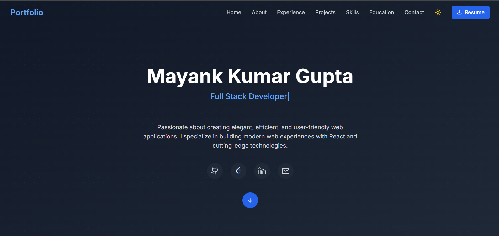
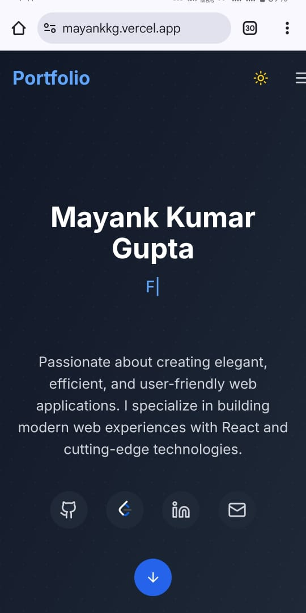

# 💼 Personal Portfolio Website

Welcome to my personal portfolio website! This is a digital representation of my journey as a **Computer Science and Engineering student**, where I showcase my **skills, experience, certifications, and projects** in a modern and responsive interface.

---

## 🚀 Features

- 👨‍💻 **About Me** — Brief overview of who I am and what I do  
- 💼 **Experience** — My internships and work history  
- 🎓 **Education** — Academic background and milestones  
- 📁 **Projects** — Highlighted projects with live links and GitHub repositories  
- 🏅 **Certifications** — Verified credentials from reputed platforms  
- 🧠 **Skills Showcase** — Visual representation of technologies and tools  
- 📬 **Contact Me** — Simple form to get in touch

---

## 🛠️ Tech Stack

- **Frontend:** React.js, Tailwind CSS  
- **Animation:** Framer Motion  
- **Form Handling:** EmailJS / FormSubmit  
- **Deployment:** Vercel  
- **Version Control:** Git & GitHub

---

## 📌 Live Demo

🔗 **Live Website:** [Visit My Portfolio](https://mayankkg.vercel.app)  
📁 **GitHub Repository:** [Source Code](https://github.com/MKG0007/My_Portfolio_Website)

---

## 📷 Screenshots

| Desktop View | Mobile View |
|--------------|-------------|
|  |  |

---

## 📬 Contact

Feel free to reach out to me:

- 📧 Email: mg258087@gmail.com  
- 💼 LinkedIn: [Your LinkedIn](https://www.linkedin.com/in/mayankgupta30/)  
- 🐙 GitHub: [Your GitHub](https://github.com/MKG0007)

---

> Designed and developed with ❤️ by **Your Name**
